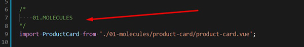

## Notes about VUE.JS on the project

#### General Notes
- Use the same atom design structure (Atoms, Molecules, Organisms and Pages).
- Comment your code wisely
- All the files and directory names follows the kebab-case pattern: lowercase and with dash. Eg.: **product-card**

#### Workflow

&#x1F538; For this example we're creating a component named **product-card**.

1. This component will be a **molecule**, so create a folder for this component within: **js/vue/components/01-molecules**. 
1. Create a file **within** the created folder. Eg.: **product-card.vue**
1. **Import** your component on index.js ( **vue/components/index.js**) adding it on the **same** atom design comment spot. See image below.
  

#### Store - VUEX
- If your component uses store, create a file for your component, with the same name, on the directory: **stores/**. Eg: **product-card.js**.
- Within stores always use **Namespacing** ([Link to the Docs](https://vuex.vuejs.org/guide/modules.html#namespacing)). That way we don't need to worry about functions with the same name in different stores.

#### Other Notes
- Name pattern to import components: PascalCase. Eg.: ***import ProductCard from "./product-card.vue"***;
- For boolean PROPS, always start with the word **"is"**. Eg.: **isLoaded**, **isProdCard**, etc. 
- Keep the methods in alphabetical order and always add a blank line space between them.
- Any question, follow the style guide on this [LINK](https://vuejs.org/v2/style-guide/). 
